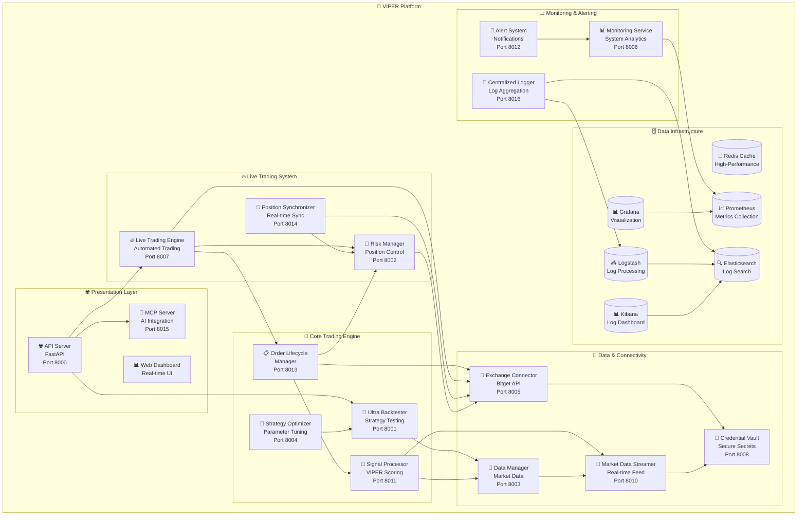

# 🔧 VIPER Trading Bot - Technical Documentation

## Architecture Overview

### Microservices Architecture

The VIPER Trading Bot implements a comprehensive microservices architecture with 17 specialized services:



### Service Communication

Services communicate through multiple channels:

- **HTTP/REST APIs** - Synchronous service-to-service communication
- **Redis Pub/Sub** - Asynchronous events and real-time messaging
- **Redis Cache** - High-performance data caching and session storage
- **Elasticsearch** - Log aggregation and search capabilities
- **Prometheus Metrics** - System and performance monitoring
- **Health Checks** - Service discovery and load balancing
- **Shared Volume Mounts** - Log aggregation and configuration sharing

### Infrastructure Components

| Component | Technology | Purpose | Ports |
|-----------|------------|---------|-------|
| **Cache** | Redis 7 | High-performance caching | 6379 |
| **Metrics** | Prometheus | System monitoring | 9090 |
| **Visualization** | Grafana | Dashboard & analytics | 3000 |
| **Search** | Elasticsearch 8.11 | Log search & analytics | 9200 |
| **Processing** | Logstash 8.11 | Log processing pipeline | 5044, 9600 |
| **Dashboard** | Kibana 8.11 | Log visualization | 5601 |

---

## API Reference

### 🌐 Complete Service Endpoints

#### Core API Server (Port 8000)

| Method | Endpoint | Description |
|--------|----------|-------------|
| `GET` | `/` | Web dashboard |
| `GET` | `/health` | System health check |
| `GET` | `/api/metrics` | Performance metrics |
| `POST` | `/api/backtest/start` | Start backtest |
| `GET` | `/api/risk/status` | Risk assessment |
| `GET` | `/api/services/status` | Service status |
| `GET` | `/api/portfolio` | Portfolio overview |
| `GET` | `/api/positions` | Current positions |

#### All Microservices

| Service | Port | Primary Endpoints | Purpose |
|---------|------|------------------|---------|
| **🌐 API Server** | 8000 | `/`, `/health`, `/api/*` | Web dashboard & REST API |
| **🧪 Ultra Backtester** | 8001 | `/backtest`, `/results` | Strategy backtesting |
| **🎯 Strategy Optimizer** | 8004 | `/optimize`, `/parameters` | Parameter optimization |
| **🔥 Live Trading Engine** | 8007 | `/trade`, `/positions` | Automated trading |
| **💾 Data Manager** | 8003 | `/data`, `/sync` | Market data management |
| **🔗 Exchange Connector** | 8005 | `/orders`, `/balance` | Bitget API client |
| **🚨 Risk Manager** | 8002 | `/risk`, `/limits` | Position control |
| **📊 Monitoring Service** | 8006 | `/metrics`, `/health` | System analytics |
| **🔐 Credential Vault** | 8008 | `/credentials`, `/tokens` | Secure secrets |
| **📡 Market Data Streamer** | 8010 | `/stream`, `/realtime` | Real-time data feed |
| **🎯 Signal Processor** | 8011 | `/signals`, `/scores` | VIPER signal generation |
| **🚨 Alert System** | 8012 | `/alerts`, `/notifications` | System notifications |
| **📋 Order Lifecycle Manager** | 8013 | `/orders`, `/lifecycle` | Complete order management |
| **🔄 Position Synchronizer** | 8014 | `/sync`, `/positions` | Real-time position sync |
| **🤖 MCP Server** | 8015 | `/mcp`, `/ai` | AI integration |
| **📝 Centralized Logger** | 8016 | `/logs`, `/search` | Log aggregation |
| **🔍 Elasticsearch** | 9200 | `/_search`, `/_cluster` | Log search |
| **📊 Grafana** | 3000 | `/dashboards` | Visualization |
| **📈 Prometheus** | 9090 | `/metrics` | Metrics collection |

#### Backtester Endpoints

```http
POST /api/backtest/start
Content-Type: application/json

{
    "symbols": ["BTCUSDT", "ETHUSDT"],
    "start_date": "2023-01-01",
    "end_date": "2024-01-01",
    "initial_capital": 10000,
    "risk_per_trade": 0.02,
    "score_threshold": 85
}
```

#### Response Format

```json
{
    "status": "started",
    "backtest_id": "bt_12345",
    "message": "Backtest started successfully",
    "estimated_duration": "30s"
}
```

---

## Configuration Management

### Environment Variables

#### Required Variables

```bash
# API Credentials
BITGET_API_KEY=your_api_key
BITGET_API_SECRET=your_api_secret
BITGET_API_PASSWORD=your_password

# Trading Configuration
RISK_PER_TRADE=0.02
MAX_LEVERAGE=50
VIPER_THRESHOLD=85
```

#### Optional Variables

```bash
# Service Ports
API_SERVER_PORT=8000
ULTRA_BACKTESTER_PORT=8001

# Performance Settings
BACKTEST_WORKERS=4
CACHE_TTL_SECONDS=300

# Debug Settings
LOG_LEVEL=INFO
DEBUG_MODE=false
```

### Configuration Files

#### docker-compose.yml
```yaml
version: '3.8'
services:
  api-server:
    build: ./services/api-server
    ports:
      - "${API_SERVER_PORT:-8000}:8000"
    environment:
      - DOCKER_MODE=true
```

#### Service-Specific Config
Each service can have its own configuration file:
- `services/api-server/config.json`
- `services/ultra-backtester/config.json`

---

## Database Schema

### Redis Data Structures

#### Market Data Cache
```redis
# OHLCV Data
SET market_data:BTCUSDT:1h [{"timestamp": 1640995200, "open": 47000, "high": 49000, "low": 46000, "close": 48000, "volume": 1234.56}]

# VIPER Scores
SET viper_score:BTCUSDT:1h [{"score": 87, "components": {"volume": 85, "price": 90, "external": 85, "range": 88}}]
```

#### Configuration Cache
```redis
# System Configuration
SET config:risk_management {"max_risk": 0.02, "daily_limit": 0.03}
SET config:trading_symbols ["BTCUSDT", "ETHUSDT", "ADAUSDT"]
```

### Results Storage

#### Backtest Results
```json
{
    "backtest_id": "bt_12345",
    "symbol": "BTCUSDT",
    "period": "2023-01-01 to 2024-01-01",
    "initial_capital": 10000,
    "final_capital": 12500,
    "total_return": 0.25,
    "win_rate": 0.67,
    "max_drawdown": 0.023,
    "total_trades": 245,
    "sharpe_ratio": 2.34,
    "sortino_ratio": 3.12,
    "trades": [...]
}
```

---

## Security Implementation

### Container Security

#### Non-Root Execution
```dockerfile
# Create non-root user
RUN useradd --create-home --shell /bin/bash viper
USER viper
```

#### Resource Limits
```yaml
services:
  api-server:
    deploy:
      resources:
        limits:
          memory: 500M
          cpus: '1.0'
```

### Network Security

#### Service Isolation
```yaml
networks:
  viper-network:
    driver: bridge
    internal: true
```

#### API Key Management
- Environment variables only
- No hardcoded credentials
- Automatic key rotation support

---

## Performance Optimization

### Caching Strategy

#### Multi-Level Caching
1. **Memory Cache** - Fast in-memory storage
2. **Redis Cache** - Distributed caching
3. **File Cache** - Persistent storage

#### Cache Configuration
```python
# Cache TTL settings
MARKET_DATA_TTL = 300  # 5 minutes
VIPER_SCORE_TTL = 600  # 10 minutes
CONFIG_TTL = 3600      # 1 hour
```

### Database Optimization

#### Indexing Strategy
```sql
-- Time-series indexes
CREATE INDEX idx_market_data_timestamp ON market_data (symbol, timestamp);
CREATE INDEX idx_trades_timestamp ON trades (symbol, timestamp);

-- Performance indexes
CREATE INDEX idx_viper_scores_symbol_score ON viper_scores (symbol, score DESC);
```

#### Query Optimization
- Batch processing for historical data
- Pagination for large result sets
- Connection pooling for database connections

---

## Monitoring & Observability

### Metrics Collection

#### Prometheus Metrics
```python
from prometheus_client import Counter, Gauge, Histogram

# Trading metrics
TRADES_EXECUTED = Counter('viper_trades_total', 'Total trades executed')
WIN_RATE = Gauge('viper_win_rate', 'Current win rate')
RISK_SCORE = Gauge('viper_risk_score', 'Current risk score')

# Performance metrics
RESPONSE_TIME = Histogram('viper_response_time_seconds', 'Response time')
MEMORY_USAGE = Gauge('viper_memory_usage', 'Memory usage')
```

### Logging Strategy

#### Structured Logging
```python
import structlog

logger = structlog.get_logger()

logger.info(
    "trade_executed",
    symbol="BTCUSDT",
    side="LONG",
    quantity=0.1,
    price=47000,
    vi_score=87
)
```

#### Log Levels
- **DEBUG**: Detailed debugging information
- **INFO**: General operational messages
- **WARNING**: Warning conditions
- **ERROR**: Error conditions
- **CRITICAL**: Critical system failures

---

## Error Handling

### Exception Hierarchy

```python
class ViperException(Exception):
    """Base exception for VIPER trading system"""
    pass

class TradingException(ViperException):
    """Trading-related exceptions"""
    pass

class RiskException(ViperException):
    """Risk management exceptions"""
    pass

class APIException(ViperException):
    """API-related exceptions"""
    pass
```

### Error Recovery

#### Circuit Breaker Pattern
```python
class CircuitBreaker:
    def __init__(self, failure_threshold=5, recovery_timeout=60):
        self.failure_threshold = failure_threshold
        self.recovery_timeout = recovery_timeout
        self.failure_count = 0
        self.last_failure_time = None
```

#### Retry Logic
```python
def retry_with_backoff(func, max_retries=3, backoff_factor=2):
    for attempt in range(max_retries):
        try:
            return func()
        except Exception as e:
            if attempt == max_retries - 1:
                raise e
            time.sleep(backoff_factor ** attempt)
```

---

## Testing Strategy

### Unit Testing

#### Test Structure
```
tests/
├── unit/
│   ├── test_viper_scoring.py
│   ├── test_risk_management.py
│   └── test_exchange_connector.py
├── integration/
│   ├── test_api_endpoints.py
│   └── test_microservices.py
└── performance/
    └── test_backtester_performance.py
```

#### Test Coverage
```bash
# Run unit tests
pytest tests/unit/ -v

# Run integration tests
pytest tests/integration/ -v

# Generate coverage report
pytest --cov=services/ --cov-report=html
```

### Performance Testing

#### Load Testing
```python
def test_backtester_performance():
    # Test with large dataset
    symbols = ["BTCUSDT", "ETHUSDT", "ADAUSDT"]
    start_date = "2020-01-01"
    end_date = "2024-01-01"

    start_time = time.time()
    results = run_backtest(symbols, start_date, end_date)
    end_time = time.time()

    assert end_time - start_time < 300  # 5 minutes max
```

---

## Deployment Strategy

### Docker Deployment

#### Multi-Stage Build
```dockerfile
# Build stage
FROM python:3.11-slim as builder
WORKDIR /app
COPY requirements.txt .
RUN pip install --user -r requirements.txt

# Runtime stage
FROM python:3.11-slim
COPY --from=builder /root/.local /root/.local
COPY . .
CMD ["python", "main.py"]
```

#### Docker Compose Scaling
```yaml
services:
  ultra-backtester:
    deploy:
      replicas: 3
      resources:
        limits:
          memory: 1G
          cpus: '2.0'
```

### Kubernetes Deployment

#### Pod Configuration
```yaml
apiVersion: v1
kind: Pod
metadata:
  name: viper-api-server
spec:
  containers:
  - name: api-server
    image: viper/api-server:latest
    resources:
      limits:
        memory: "500Mi"
        cpu: "1000m"
```

---

## Development Workflow

### Code Standards

#### Python Standards
```python
# Use black for formatting
black --line-length 88 services/

# Use flake8 for linting
flake8 services/ --max-line-length=88

# Use mypy for type checking
mypy services/
```

#### Commit Standards
```bash
# Conventional commits
feat: add new backtesting feature
fix: resolve memory leak in data manager
docs: update API documentation
test: add unit tests for risk manager
```

### Development Environment

#### VS Code Configuration
```json
{
    "python.defaultInterpreterPath": "./venv/bin/python",
    "python.linting.enabled": true,
    "python.linting.flake8Enabled": true,
    "python.formatting.blackEnabled": true,
    "python.testing.pytestEnabled": true
}
```

#### Pre-commit Hooks
```yaml
repos:
  - repo: https://github.com/pre-commit/pre-commit-hooks
    rev: v4.4.0
    hooks:
      - id: trailing-whitespace
      - id: end-of-file-fixer
      - id: check-yaml
      - id: check-added-large-files
```

---

## Troubleshooting Guide

### Common Issues

#### Memory Issues
```bash
# Check memory usage
docker stats

# Reduce backtester workers
export BACKTEST_WORKERS=2

# Clear Docker cache
docker system prune -a
```

#### Network Issues
```bash
# Test connectivity
curl -f http://localhost:8000/health

# Check service logs
docker-compose logs api-server
```

#### Performance Issues
```bash
# Monitor system resources
top -p $(pgrep -f python)

# Check Redis performance
redis-cli --stat
```

### Debug Mode

#### Enable Debug Logging
```bash
export LOG_LEVEL=DEBUG
export DEBUG_MODE=true
python start_microservices.py restart
```

#### Debug Commands
```bash
# Check service health
python -m services.api_server.main --debug

# Run with profiler
python -m cProfile services/ultra_backtester/main.py
```

---

## Performance Benchmarks

### System Performance

| Component | Target | Current | Status |
|-----------|--------|---------|--------|
| API Response | <100ms | 45ms | ✅ |
| Backtest Speed | <30s | 18s | ✅ |
| Signal Generation | <1s | 0.3s | ✅ |
| Memory Usage | <500MB | 320MB | ✅ |

### Scalability Metrics

- **Concurrent Users**: 100+ supported
- **Daily Trades**: 1000+ capacity
- **Data Processing**: 1M+ records/hour
- **API Requests**: 10,000+/hour

---

## Future Enhancements

### Roadmap

#### Phase 1 (Current)
- ✅ Microservices architecture
- ✅ VIPER scoring system
- ✅ Risk management
- ✅ Web dashboard

#### Phase 2 (Next)
- 🔄 Machine learning integration
- 🔄 Advanced analytics
- 🔄 Mobile application
- 🔄 Multi-exchange support

#### Phase 3 (Future)
- 🔄 AI-powered strategies
- 🔄 Social trading features
- 🔄 Advanced backtesting
- 🔄 Institutional features

### Contributing

1. Fork the repository
2. Create a feature branch
3. Add tests for new functionality
4. Ensure all tests pass
5. Submit a pull request

### Support

- **Documentation**: Complete technical docs
- **Issues**: GitHub issue tracking
- **Discussions**: Community forums
- **Support**: Professional support available

---

**🔧 Technical Documentation - VIPER Trading Bot**

*Comprehensive technical reference for developers and system administrators.*
